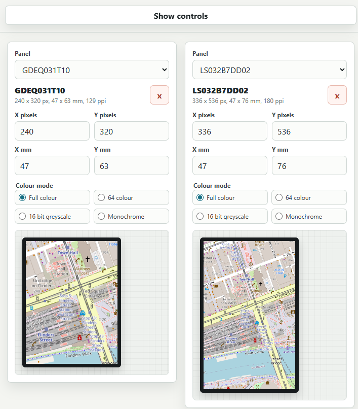

# Documentation for Electronics Projects

## displayModuleImageTester.html
A HTML page designed to help assess the static display capabilites of small display modules, without having to buy one.
- Load an image, and you can view and compare an approximately scaled output on one or more virtual displays.
- Accepts the XY pixels, physical dimensions, and can make an attempt to simulate limited colour palletes.
- Image is cropped to the same number of pixels as the display, then scaled to the physical size
- The example defaults to a selection of E-Ink and MIPs displays.
- Coded with GPT-5.5.

