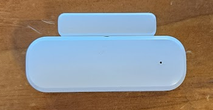
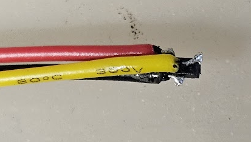
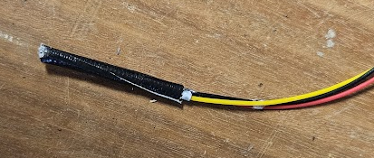
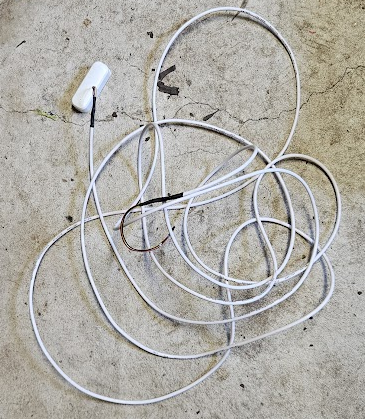
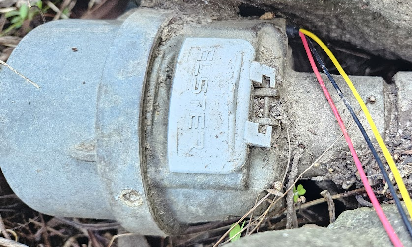

Hi Everyone, here’s how I modified a modern reedless door sensor for my Melbourne, Australia water meter.


Generic Zigbee door/window sensor:


Internal PCB. The hall sensor is H1 circled in red.


Desolder the hall sensor, and wire in your extension wires VCC/GND/Signal


Solder the hall sensor to the other end of your extension wires. Try to ensure you get a solid connection, my first try came unstuck when I was trying to find the right probe location. It may be a good idea to first put a blob of hot glue around the sensor to mechanically reinforce the connection.



Create a probe 4.5mm in diameter and around 30mm long (the meter's probe hole is about 40mm deep) using heat shrink or tape. You want the probe to fit in the meter, but not be too easily knocked out of position. To provide structure, first I used a nail, which transmitted the magnetic pulse with low positioning accuracy required, but I was concerned about long term magnetisation of the nail causing the sensor to become faulty over time.

Instead I used a piece of bamboo skewer, but the positioning of the hall sensor needs to be quite precise (within a few mm)



Testing on new batteries I reliably received a signal on a 5m cable (my in place implementation is around 3.5m)



As mentioned above, placement of the hall sensor needs to be quite precise. Turn a tap on so your meter is running, and hunt around for the correct position by watching for the red light on your sensor.

On my meter the hall sensor is located approx 5mm inside the probe hole.



**Home Assistant Configuration**

- Add the zigbee sensor to Home Assistant as device name ‘WaterMain’

- Add to your configuration.yaml:
  - This creates a total use counter entity “Total Water Usage” that is updated by the pulses from your sensor, and a daily resetting entity “Daily Water Usage” that can be used on your energy dashboard.
  - My meter counts in 5L increments. If your meter has a different pulse rate, change the 2 instances of the number five “5” to match your meter rate.

```
# Water Meter
counter:
  water_usage_events:
    initial: 0
    step: 1
template:
  - sensor:
      - name: "Total Water Usage"
        state: >
          
            {{ (states('counter.water_usage_events') | int) * 5 }}
          
            {{ (states('counter.water_usage_events') | int) * 5 }}
          
        unit_of_measurement: "L"
        device_class: "water"
        state_class: "total_increasing"
utility_meter:
  daily_water_usage:
    name: Daily Water Usage
    source: sensor.daily_water_usage
    cycle: daily
```

Create this automation, which adds to the counter on a pulse event:

```
alias: Count Water Usage Events
triggers:
  - entity_id: binary_sensor.watermain
    from: "on"
    to: "off"
    trigger: state
actions:
  - entity_id: counter.water_usage_events
    action: counter.increment
```

Add graphs to your dashboards, and enjoy visibility of your water consumption!